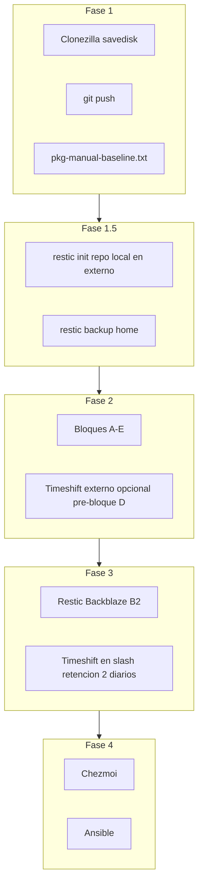

# Contexto de Migración de Dotfiles (AGENTS.md)

Documento de referencia para agentes y para retomar el trabajo de migración. El README es la guía de usuario; este archivo registra decisiones, estado y pendientes.

## Objetivo

Migrar un entorno de trabajo personalizado (i3wm en Ubuntu) a nuevo hardware. Estrategia en dos etapas:

1. **Ahora:** limpiar el sistema actual con backups fiables (Clonezilla, Restic, Timeshift).
2. **Después:** Chezmoi + Ansible para dotfiles y bootstrap reproducible.

Convención XDG: todo lo que vive en `~/.config/foo` va en `dotfiles/config/foo`, salvo secretos (p. ej. `gh/hosts.yml`).

## Estrategia de backup (definitiva)

Cuatro capas complementarias; cada una cubre un fallo distinto:

| Capa | Herramienta | Qué protege | Cuándo |
|------|-------------|-------------|--------|
| Nuclear | **Clonezilla** `savedisk` | Disco NVMe completo (GPT, EFI, arranque, SO) | Fase 1; conservar imagen en externo |
| Datos `/home` | **Restic** (local → luego B2) | Archivos personales, SSH, secretos locales | Fase 1.5 (local); Fase 3 (nube) |
| SO en runtime | **Timeshift** en `/` | Rollback tras `apt upgrade` roto (gráficos, drivers) | Fase 3 permanente; opcional Fase 2 |
| Config | **Git** → **Chezmoi** | Dotfiles versionados | Fase 1 push; Fase 4 migración |

**Filosofía:** Ansible/Chezmoi aprovisionan el estado deseado (*cattle*), pero Timeshift complementa lo que Ansible no deshace (roturas aguas abajo por actualizaciones). Restic es el backup que importa para datos personales. Clonezilla es el último recurso.

**Descartado explícitamente:**
- Reparticionar el NVMe para una partición Timeshift dedicada.
- Múltiples snapshots Timeshift por bloque de limpieza (HDD USB = horas).
- Desinstalar Timeshift tras Ansible.

---

## Plan definitivo — fases



### Hardware previo

Disco externo **≥ 500 GB** (mínimo 250 GB), formato **ext4**, etiqueta `BACKUP`. USB Clonezilla Live.

Contenido estimado en externo: imagen Clonezilla (~145 GB comprimidos) + repo Restic local + margen.

### Fase 1 — Baseline

Sin Timeshift configurado, sin Restic en nube, sin Chezmoi. **No borrar nada.**

1. **Clonezilla** `device-image` → **`savedisk`** del NVMe (`/dev/nvme0n1`) si el externo ≥ 500 GB.  
   - Preserva GPT, EFI y layout completo (p3/p4 desconocidas).  
   - Si el externo es < 500 GB: `saveparts` de `p1` (`/boot/efi`) + `p5` (`/`).  
   - Etiqueta: `2025-pre-limpieza-baseline`.
2. Guardar `partition-layout.txt` (`lsblk -f`, `fdisk -l`) en el externo.
3. **`git push`** de este repo → `https://github.com/DanielHidalgoChica/dotfiles.git`.
4. Congelar apt: `pkg-manual-baseline.txt`, `pkg-selections-baseline.txt` en el externo.

### Fase 1.5 — Restic local de `/home` (antes de limpiar archivos)

Instalar `restic`. Inicializar repo **local** en el externo:

```bash
restic init -r /media/BACKUP/restic-home-local
restic -r /media/BACKUP/restic-home-local backup ~ --exclude-file ~/.config/restic/exclude.txt
```

Exclusiones típicas: `.cache`, `.local/share/Trash`, `.local/share/JetBrains`, `Downloads`, `.nvm`, `dotfiles/.git`.

**Por qué:** si se borra por error un archivo en `/home` durante Fase 2, `restic restore` en segundos; Clonezilla sería desproporcionado.

### Fase 2 — Limpieza (1–2 sesiones)

**Red de seguridad:**

| Problema | Solución |
|----------|----------|
| Archivo `/home` borrado por error | `restic restore` desde repo local |
| Paquete purgado por error | `pkg-manual-baseline.txt` + `sudo apt install` |
| Symlink roto | `./make.sh` |
| i3/red caídos | TTY `Ctrl+Alt+F3` |
| Desastre grave | Clonezilla Fase 1 |
| Pre-bloque D (opcional) | Un snapshot Timeshift en externo, sin `/home` |

**Bloques de limpieza:**

| Bloque | Acción | Riesgo |
|--------|--------|--------|
| A | Papelera, caché, archivar `~/dotfiles_old`, `.old_vimrc` | Ninguno |
| B | Triaje: spotify, transmission, godot, wireshark, VirtualBox | Medio |
| C | `apt purge --simulate` → purge `neovim` apt, obsoletos | Medio |
| D | Poda meta `ubuntu-desktop`; conservar evince, gnome-disk-utility, file-roller, seahorse, gnome-calculator | Alto |
| E | Verificar nvim 0.10.3 en Cursor; purgar `neovim` apt | Bajo |

Reglas: `apt purge --simulate` siempre primero; `autoremove` solo al final de sesión, con `--simulate`.

Cierre: `pkg-manual-after-cleanup.txt` → semilla de roles Ansible.

### Fase 3 — Infraestructura permanente

**Sin reparticionar el NVMe.**

1. **Restic + Backblaze B2** (off-site): `restic init` en bucket B2; timer diario; retención `--keep-daily 7 --keep-weekly 4 --keep-monthly 6`. Probar `restic restore` antes de Fase 4.
2. **Timeshift en `/`** (misma partición raíz, modo RSYNC, **excluir `/home`**):
   - Retención estricta: 2 snapshots diarios + snapshot en boot.
   - Complementa Ansible: rollback en ~3 min si un `apt upgrade` rompe gráficos/drivers.
   - **No desinstalar** en Fase 4.

### Fase 4 — Chezmoi + Ansible

- **Chezmoi** sustituye `make.sh`; `vimrc_minimal` sigue como fuente única de keybindings IDE.
- **Ansible** sustituye `install.sh`; roles: `base`, `desktop`, `dev`, `backup` (restic + timeshift), `chezmoi`.
- Paquetes deseados: `pkg-manual-after-cleanup.txt` + `packages-*.txt`.
- Validar playbook en VM o instalación limpia antes de retirar `make.sh`/`install.sh`.

Bootstrap máquina nueva (objetivo final):

```bash
ansible-playbook site.yml
chezmoi apply
```

---

## Estado actual del repositorio

| Área | Estado |
|------|--------|
| Symlinks | `make.sh` idempotente; backups en `~/dotfiles_old/` |
| Bootstrap | `install.sh` — apt por capas + `make.sh` + vim-plug |
| Editor | Vim (terminal/LaTeX) + Neovim mínimo (vscode-neovim); coc purgado |
| WM / desktop | `config/i3/`, `config/picom/` |
| XDG versionado | `config/gtk-3.0/`, `config/gh/config.yml` |
| Dependencias apt | `packages-base.txt`, `packages-desktop.txt`, `packages-dev.txt` |
| Backup / IaC | **Pendiente** — ver plan definitivo arriba |

### Estructura del repo

```
~/dotfiles/
├── install.sh              # bootstrap máquina nueva (→ Ansible Fase 4)
├── make.sh                 # symlinks HOME + ~/.config (→ Chezmoi Fase 4)
├── packages-base.txt       # git, curl, build-essential
├── packages-desktop.txt    # stack i3wm
├── packages-dev.txt        # vim, ripgrep, fzf, gh, texlive, …
├── scripts/
│   ├── install-neovim-vscode.sh
│   └── purge-nvim-coc.sh   # ya ejecutada
├── config/                 # → ~/.config/* (XDG)
│   ├── i3/, picom/, gtk-3.0/
│   ├── nvim/init.vim       # → vimrc_minimal (vscode-neovim)
│   └── gh/config.yml       # hosts.yml NO versionado
├── vim/, vimrc             # LaTeX + vim-plug
├── bashrc, bash_aliases, bash_profile, xprofile
├── gitconfig, editorconfig, vimrc_minimal
└── AGENTS.md, README.md
```

### Bootstrap actual (hasta Fase 4)

```bash
git clone <repo> ~/dotfiles && cd ~/dotfiles
./install.sh              # base + desktop + dev + symlinks + vim-plug
./install.sh --list       # dry-run
./install.sh --skip-apt   # solo symlinks y vim-plug
```

**Fuera de apt** (manual): wallpaper `~/Daniel/Personal/black.jpeg`, TeX Live en `/usr/local/texlive/` si aplica, drivers GPU, AppImages, `gh auth login`.

---

## Plan de migración — progreso

| Fase | Todo | Estado |
|------|------|--------|
| Deuda XDG | `fix-xdg-debt` | Hecho |
| Dependencias | `create-packages-layers` | Hecho |
| Bootstrap | `create-install-sh` | Hecho |
| Auditoría i3 | `audit-i3-stack` | Hecho |
| Purgas | `purge-nvim-coc` | Hecho |
| Documentación | `update-docs` | Hecho |
| Neovim IDE | `setup-nvim-vscode` | Hecho |
| **Fase 1** | Clonezilla + git push + pkg baseline | **Pendiente** |
| **Fase 1.5** | Restic local `/home` en externo | **Pendiente** |
| **Fase 2** | Limpieza bloques A–E + triaje apps | **Pendiente** |
| **Fase 3** | Restic B2 + Timeshift permanente en `/` | **Pendiente** |
| **Fase 4** | Chezmoi + Ansible | **Pendiente** |

---

## Tareas pendientes

### 1. Comprar disco externo (antes de Fase 1)

≥ 500 GB recomendado; ext4; etiqueta `BACKUP`. USB Clonezilla Live.

### 2. `audit-optional-apps` (bloque B de Fase 2)

| App | Archivos aprox. | Notas |
|-----|-----------------|-------|
| spotify | ~8 | ¿uso habitual? |
| transmission | ~4 | cliente torrent |
| godot | ~2 + 2 GB `.local/share` | ¿proyectos activos? |
| wireshark | ~5 | perfil de captura |
| VirtualBox | ~35 | VMs; exportar antes de purgar |

### 3. Checklist post-Fase 4 (máquina nueva)

- [ ] `ansible-playbook site.yml` + `chezmoi apply`
- [ ] Restic B2 operativo; Timeshift en `/` con retención configurada
- [ ] i3 + picom + rofi; audio; red; LaTeX; Cursor + vscode-neovim
- [ ] `gh auth login`; wallpaper `~/Daniel/...`

---

## Triaje de `~/.config` — registro de decisiones

| Entrada | Decisión | Estado | Notas |
|---------|----------|--------|-------|
| `i3` | Consolidar | Hecho | `config/i3/` |
| `picom` | Consolidar | Hecho | `config/picom/` |
| `i3blocks` | Consolidar parcial | Hecho | Solo `i3blocks.conf` |
| `gtk-3.0` | Consolidar | Hecho | Solo `settings.ini` |
| `gh` | Consolidar parcial | Hecho | `config.yml` versionado; `hosts.yml` → Restic |
| `nvim` | Consolidar mínimo | Hecho | `init.vim` → `vimrc_minimal`; nvim 0.10.3 tarball |
| `coc` | Purgar | Hecho | Backup en `~/dotfiles_old/nvim-coc-purge-*` |
| Apps opcionales | Revisar | Pendiente | Fase 2 bloque B |
| Perfiles runtime | Ignorar | — | Chrome, Cursor, Code, JetBrains, LibreOffice, pulse |

---

## Editores: Vim + Neovim mínimo

| Archivo | Rol | Usado por |
|---------|-----|-----------|
| `vimrc` + `vim/` | vim-plug, vimtex, UltiSnips, fzf | Vim terminal |
| `vimrc_minimal` | Keybindings ligeros | Neovim vía vscode-neovim |
| `config/nvim/init.vim` | Wrapper `g:vscode` | Cursor |

**Versión mínima:** Neovim ≥ 0.10.0 (`scripts/install-neovim-vscode.sh` → `~/.local/opt/nvim-linux64`).

---

## Flujo LaTeX (Vim)

| Capacidad | Implementación | apt |
|-----------|----------------|-----|
| Compilación | vimtex + latexmk | texlive-*, latexmk |
| PDF + SyncTeX | zathura | zathura |
| Snippets | UltiSnips | vim-plug |
| Atajos | `,l` `,c` `,v` | — |

---

## Deuda técnica resuelta

- Symlink roto `~/.i3` eliminado
- `i3blocks.conf` en ruta XDG; scripts desde apt
- `make.sh` idempotente
- coc eliminado; Neovim 0.10.3 vía tarball para vscode-neovim

## Próximo paso inmediato

**Fase 1:** comprar disco externo ≥ 500 GB; Clonezilla `savedisk` + `git push` + `pkg-manual-baseline.txt`.
