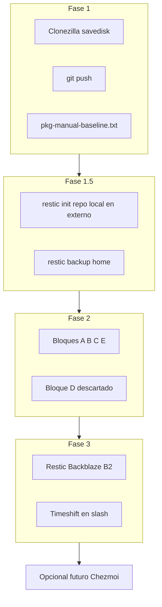

# Contexto de Migración de Dotfiles (AGENTS.md)

Documento de referencia para agentes y para retomar el trabajo de migración. El README es la guía de usuario; este archivo registra decisiones, estado y pendientes.

## Objetivo

Migrar un entorno de trabajo personalizado (i3wm en Ubuntu) a nuevo hardware (o reinstalar limpio). Estrategia:

1. **Backups fiables:** Clonezilla + Restic (+ Timeshift permanente).
2. **Bootstrap ligero:** Git + [`install.sh`](install.sh) + [`make.sh`](make.sh) (ya existente).
3. **Limpieza pragmática:** bloques A–C/E; **sin** poda agresiva de `ubuntu-desktop` (bloque D descartado).

Convención XDG: todo lo que vive en `~/.config/foo` va en `dotfiles/config/foo`, salvo secretos (p. ej. `gh/hosts.yml`).

## Bootstrap: ¿es suficiente make.sh + install.sh?

**Sí, para una sola máquina Ubuntu/Debian (o pocas).** El repo actual ya cubre migración con poco dolor:

| Capacidad | Cómo |
|-----------|------|
| Paquetes | `packages-{base,desktop,dev}.txt` + `install.sh` |
| Symlinks idempotentes | `make.sh` |
| Neovim ≥ 0.10 | `scripts/install-neovim-vscode.sh` |
| Vim plugins | vim-plug en primer `install.sh` |
| Documentación | README + checklist post-install |

**Migración típica a máquina nueva:**

```bash
git clone https://github.com/DanielHidalgoChica/dotfiles.git ~/dotfiles
cd ~/dotfiles && ./install.sh
# manual: gh auth login, wallpaper, drivers, Cursor + vscode-neovim path
restic restore …   # datos personales desde B2 o externo
```

### Qué ganarías con Chezmoi

| Ventaja | ¿La necesitas? |
|---------|----------------|
| Templates (hostname, email, OS distintos) | Solo si varias máquinas con configs distintas |
| `chezmoi apply` en un comando + secrets cifrados | Útil, pero `gh/hosts.yml` + Restic ya cubren secretos |
| Gestión de permisos / scripts on-change | Overkill para bash/i3/vim estáticos |

**Conclusión:** Chezmoi aporta poco si todo es Ubuntu + mismos paths. **Diferido** hasta tener 2+ máquinas o necesidad real de templates.

### Qué ganarías con Ansible

| Ventaja | ¿La necesitas? |
|---------|----------------|
| Idempotencia multi-host, roles, vault | Flota de servidores / muchas máquinas |
| Sustituir `install.sh` | `install.sh` ya hace apt + make + nvim + vim-plug |
| Documentar estado del SO como código | Los `packages-*.txt` ya lo documentan |

**Conclusión:** Ansible es **overkill** para un laptop personal con un script de ~230 líneas que ya funciona. **Cancelado** como fase obligatoria.

### Huecos reales del enfoque actual (mejoras baratas)

No requieren Chezmoi/Ansible; se pueden ir cerrando en el repo:

- Añadir a `packages-*.txt` lo que uses a diario tras el triaje (docker, ansible-lint, etc. solo si KEEP).
- Documentar en README el restore Restic + Timeshift.
- Opcional: un `scripts/bootstrap-new-machine.md` checklist de 10 líneas.
- Secretos: siguen fuera de git (Restic + `gh auth login`).

## Estrategia de backup (definitiva)

Cuatro capas complementarias; cada una cubre un fallo distinto:

| Capa | Herramienta | Qué protege | Cuándo |
|------|-------------|-------------|--------|
| Nuclear | **Clonezilla** `savedisk` | Disco NVMe completo (GPT, EFI, arranque, SO) | Fase 1; conservar imagen en externo |
| Datos `/home` | **Restic** (local → luego B2) | Archivos personales, SSH, secretos locales | Fase 1.5 (local); Fase 3 (nube) |
| SO en runtime | **Timeshift** en `/` | Rollback tras `apt upgrade` roto (gráficos, drivers) | Fase 3 permanente |
| Config | **Git** + `install.sh`/`make.sh` | Dotfiles y bootstrap | Continuo |

**Filosofía:** el SO se reinstala con `install.sh`; los datos viven en Restic; Timeshift evita reinstalar por un `apt upgrade` roto; Clonezilla es el último recurso.

**Descartado explícitamente:**
- Reparticionar el NVMe para una partición Timeshift dedicada.
- Múltiples snapshots Timeshift por bloque de limpieza.
- Bloque D (poda meta `ubuntu-desktop`) — alto riesgo, bajo beneficio si el objetivo es migrar limpio.
- Chezmoi / Ansible como fase obligatoria (revisar solo si hay multi-máquina o templates).

---

## Plan definitivo — fases



### Hardware previo

Disco externo **≥ 500 GB** (mínimo 250 GB), formato **ext4**, etiqueta `BACKUP`. USB Clonezilla Live.

Contenido estimado en externo: imagen Clonezilla (~145 GB comprimidos) + repo Restic local + margen.

### Fase 1 — Baseline

Sin Timeshift configurado, sin Restic en nube, sin Chezmoi. **No borrar nada.**

1. **Clonezilla** `device-image` → **`savedisk`** del NVMe (`/dev/nvme0n1`) si el externo ≥ 500 GB.  
   - Preserva GPT, EFI y layout completo (p3/p4 desconocidas).  
   - Si el externo es < 500 GB: `saveparts` de `p1` (`/boot/efi`) + `p5` (`/`).  
   - Etiqueta: `2025-pre-limpieza-baseline`.
2. Guardar `partition-layout.txt` (`lsblk -f`, `fdisk -l`) en el externo.
3. **`git push`** de este repo → `https://github.com/DanielHidalgoChica/dotfiles.git`.
4. Congelar apt: `pkg-manual-baseline.txt`, `pkg-selections-baseline.txt` en el externo.

### Fase 1.5 — Restic local de `/home` (antes de limpiar archivos)

Instalar `restic`. Inicializar repo **local** en el externo:

```bash
restic init -r /media/BACKUP/restic-home-local
restic -r /media/BACKUP/restic-home-local backup ~ --exclude-file ~/.config/restic/exclude.txt
```

Exclusiones típicas: `.cache`, `.local/share/Trash`, `.local/share/JetBrains`, `Downloads`, `.nvm`, `dotfiles/.git`.

**Por qué:** si se borra por error un archivo en `/home` durante Fase 2, `restic restore` en segundos; Clonezilla sería desproporcionado.

### Fase 2 — Limpieza ligera (sin bloque D)

**Objetivo:** quitar basura y apps que no uses; **no** pelear con el meta-paquete GNOME. Un sistema “más o menos limpito” + backups + `install.sh` basta para migrar.

**Red de seguridad:**

| Problema | Solución |
|----------|----------|
| Archivo `/home` borrado por error | `restic restore` desde repo local |
| Paquete purgado por error | `pkg-manual-baseline.txt` + `sudo apt install` |
| Symlink roto | `./make.sh` |
| i3/red caídos | TTY `Ctrl+Alt+F3` |
| Desastre grave | Clonezilla Fase 1 |

**Bloques:**

| Bloque | Acción | Estado |
|--------|--------|--------|
| A | Papelera, caché, `dotfiles_old`, `.old_vimrc` | Hacer / hecho según sesión |
| B | Triaje: spotify, transmission, godot, wireshark, VirtualBox | En curso |
| C | purge `neovim` apt, obsoletos (`--simulate` primero) | Hacer |
| D | Poda `ubuntu-desktop` | **Descartado** |
| E | nvim 0.10.x en Cursor; purgar `neovim` apt | Hacer |

Reglas: `apt purge --simulate` siempre primero; **no** `autoremove` a ciegas (puede arrastrar cups/impresoras/mesa).

Cierre: `pkg-manual-after-cleanup.txt` (inventario, no semilla Ansible).

### Fase 3 — Infraestructura permanente (prioridad)

**Sin reparticionar el NVMe.** Scripts en el repo:

| Script / archivo | Rol |
|------------------|-----|
| [`scripts/configure-timeshift.sh`](scripts/configure-timeshift.sh) | Timeshift en `/`, excluye `/home`, 2 diarios + boot |
| [`scripts/restic-backup.sh`](scripts/restic-backup.sh) | `backup` + `forget --prune` + `check` |
| [`config/restic/restic.env.example`](config/restic/restic.env.example) | Plantilla B2 / password (copiar a `~/.config/restic/restic.env`) |
| [`config/systemd/user/restic-backup.{service,timer}`](config/systemd/user/) | Timer diario systemd --user |

#### 3.1 Timeshift en `/` (ejecutar en terminal con sudo)

Estado previo: Timeshift apuntaba a un USB antiguo (`UUID=365ce79e…` → `/media/timeshift-usb`) **no conectado**. Hay que apuntarlo a la raíz (`linux_part`).

```bash
~/dotfiles/scripts/configure-timeshift.sh
# o a mano: timeshift-gtk → Location = linux_part (/), desmarcar Home,
# Schedule: Daily=2, Boot=2, Weekly/Monthly=0
```

Verificar: `sudo timeshift --list` y que los snapshots vivan bajo `/timeshift` en el NVMe.

#### 3.2 Restic → Backblaze B2

1. Cuenta en https://secure.backblaze.com/ → crear **bucket** (privado) + **Application Key** (solo ese bucket).
2. Anotar: Key ID, Application Key, región S3 del bucket (p. ej. `eu-central-003`).
3. Configurar:

```bash
cp ~/dotfiles/config/restic/restic.env.example ~/.config/restic/restic.env
chmod 600 ~/.config/restic/restic.env
# Edit: B2_ACCOUNT_ID (= keyID), B2_ACCOUNT_KEY, RESTIC_REPOSITORY, RESTIC_PASSWORD
```

4. Inicializar repo en B2 (una vez):

```bash
set -a && source ~/.config/restic/restic.env && set +a
restic -r "$RESTIC_REPOSITORY" init
```

5. Primer backup + retención:

```bash
~/dotfiles/scripts/restic-backup.sh
```

6. Probar restore (obligatorio):

```bash
restic snapshots
restic restore latest --target /tmp/restic-test --include "$HOME/Daniel"
ls /tmp/restic-test/home/daniel/Daniel | head
```

7. Timer diario:

```bash
mkdir -p ~/.config/systemd/user
cp ~/dotfiles/config/systemd/user/restic-backup.* ~/.config/systemd/user/
systemctl --user daemon-reload
systemctl --user enable --now restic-backup.timer
systemctl --user list-timers | grep restic
# Mantener sesión: sudo loginctl enable-linger "$USER"
```

**Nota:** el repo local `/media/BACKUP/restic-home-local` se conserva como copia en el externo; B2 es la copia off-site. Misma `RESTIC_PASSWORD` recomendada si quieres copiar snapshots entre repos más adelante (`restic copy`).

#### 3.3 Qué NO hacer

- No reparticionar el NVMe.
- No incluir `/home` en Timeshift (Restic lo cubre).
- No commitear `restic.env` ni la password.

### Fase 4 — Opcional / diferido

- **No obligatoria.** Bootstrap permanente = `git clone` + `./install.sh` + Restic restore.
- Reconsiderar Chezmoi solo si: 2+ máquinas con configs distintas, o secrets templates.
- Reconsiderar Ansible solo si: varias máquinas o necesidad de orquestar más que apt+symlinks.

---

## Estado actual del repositorio

| Área | Estado |
|------|--------|
| Symlinks | `make.sh` idempotente; backups en `~/dotfiles_old/` |
| Bootstrap | `install.sh` — apt por capas + `make.sh` + vim-plug + nvim tarball |
| Editor | Vim (terminal/LaTeX) + Neovim mínimo (vscode-neovim); coc purgado |
| WM / desktop | `config/i3/`, `config/picom/` |
| XDG versionado | `config/gtk-3.0/`, `config/gh/config.yml`, `config/restic/exclude.txt` |
| Dependencias apt | `packages-base.txt`, `packages-desktop.txt`, `packages-dev.txt` |
| Backup / IaC | Backups: en curso. Bootstrap permanente: **install.sh/make.sh** (Chezmoi/Ansible diferidos) |

### Estructura del repo

```
~/dotfiles/
├── install.sh              # bootstrap máquina nueva (permanente)
├── make.sh                 # symlinks HOME + ~/.config (permanente)
├── packages-base.txt       # git, curl, build-essential
├── packages-desktop.txt    # stack i3wm
├── packages-dev.txt        # vim, ripgrep, fzf, gh, texlive, …
├── scripts/
│   ├── install-neovim-vscode.sh
│   └── purge-nvim-coc.sh   # ya ejecutada
├── config/                 # → ~/.config/* (XDG)
│   ├── i3/, picom/, gtk-3.0/, nvim/, rofi/
│   ├── gh/config.yml       # hosts.yml NO versionado
│   └── restic/exclude.txt
├── vim/, vimrc             # LaTeX + vim-plug
├── bashrc, bash_aliases, bash_profile, xprofile
├── gitconfig, editorconfig, vimrc_minimal
└── AGENTS.md, README.md
```

### Bootstrap (máquina nueva)

```bash
git clone <repo> ~/dotfiles && cd ~/dotfiles
./install.sh              # base + desktop + dev + symlinks + nvim + vim-plug
./install.sh --list       # dry-run
./install.sh --skip-apt   # solo symlinks y vim-plug
```

Luego: `gh auth login`, wallpaper, drivers, Cursor + path a nvim; `restic restore` de datos personales.

---

## Plan de migración — progreso

| Fase | Todo | Estado |
|------|------|--------|
| Deuda XDG | `fix-xdg-debt` | Hecho |
| Dependencias | `create-packages-layers` | Hecho |
| Bootstrap | `create-install-sh` | Hecho |
| Auditoría i3 | `audit-i3-stack` | Hecho |
| Purgas | `purge-nvim-coc` | Hecho |
| Documentación | `update-docs` | Hecho |
| Neovim IDE | `setup-nvim-vscode` | Hecho |
| **Fase 1** | Clonezilla + git push + pkg baseline | Hecho / en curso |
| **Fase 1.5** | Restic local `/home` en externo | En curso |
| **Fase 2** | Limpieza A–C/E (sin D) + triaje apps | C/E hechos; B según sesión |
| **Fase 2 D** | Poda ubuntu-desktop | **Descartado** |
| **Fase 3** | Restic B2 + Timeshift permanente en `/` | **En curso** (scripts listos) |
| **Fase 4** | Chezmoi + Ansible | **Diferido / no obligatorio** |

---

## Tareas pendientes

### 1. Cerrar Fase 2 ligera

- Terminar triaje B (spotify, wireshark, VirtualBox si aplica).
- Bloques C/E: `neovim` apt y obsoletos con `--simulate`.
- `pkg-manual-after-cleanup.txt` en el externo.
- **No** hacer bloque D.

### 2. Fase 3 — backups permanentes

- Restic → Backblaze B2 + timer + prueba de restore.
- Timeshift en `/` (sin `/home`), retención 2 diarios + boot.

### 3. Checklist migración (máquina nueva, sin Chezmoi/Ansible)

- [ ] `git clone` + `./install.sh`
- [ ] Restic restore de datos; Timeshift configurado
- [ ] i3 + picom + rofi; audio; red; LaTeX; Cursor + vscode-neovim
- [ ] `gh auth login`; wallpaper `~/Daniel/...`

---

## Triaje de `~/.config` — registro de decisiones

| Entrada | Decisión | Estado | Notas |
|---------|----------|--------|-------|
| `i3` | Consolidar | Hecho | `config/i3/` |
| `picom` | Consolidar | Hecho | `config/picom/` |
| `i3blocks` | Consolidar parcial | Hecho | Solo `i3blocks.conf` |
| `gtk-3.0` | Consolidar | Hecho | Solo `settings.ini` |
| `gh` | Consolidar parcial | Hecho | `config.yml` versionado; `hosts.yml` → Restic |
| `nvim` | Consolidar mínimo | Hecho | `init.vim` → `vimrc_minimal`; nvim 0.10.3 tarball |
| `coc` | Purgar | Hecho | Backup en `~/dotfiles_old/nvim-coc-purge-*` |
| Apps opcionales | Revisar | Pendiente | Fase 2 bloque B |
| Perfiles runtime | Ignorar | — | Chrome, Cursor, Code, JetBrains, LibreOffice, pulse |

---

## Editores: Vim + Neovim mínimo

| Archivo | Rol | Usado por |
|---------|-----|-----------|
| `vimrc` + `vim/` | vim-plug, vimtex, UltiSnips, fzf | Vim terminal |
| `vimrc_minimal` | Keybindings ligeros | Neovim vía vscode-neovim |
| `config/nvim/init.vim` | Wrapper `g:vscode` | Cursor |

**Versión mínima:** Neovim ≥ 0.10.0 (`scripts/install-neovim-vscode.sh` → `~/.local/opt/nvim-linux64`).

---

## Flujo LaTeX (Vim)

| Capacidad | Implementación | apt |
|-----------|----------------|-----|
| Compilación | vimtex + latexmk | texlive-*, latexmk |
| PDF + SyncTeX | zathura | zathura |
| Snippets | UltiSnips | vim-plug |
| Atajos | `,l` `,c` `,v` | — |

---

## Deuda técnica resuelta

- Symlink roto `~/.i3` eliminado
- `i3blocks.conf` en ruta XDG; scripts desde apt
- `make.sh` idempotente
- coc eliminado; Neovim 0.10.3 vía tarball para vscode-neovim

## Próximo paso inmediato

**Fase 3 (ejecutar tú en terminal, necesita sudo + cuenta B2):**

```bash
# 1) Timeshift → /
~/dotfiles/scripts/configure-timeshift.sh

# 2) B2: crear bucket + key en backblaze.com, luego:
cp ~/dotfiles/config/restic/restic.env.example ~/.config/restic/restic.env
chmod 600 ~/.config/restic/restic.env
# editar restic.env → source + restic init + ~/dotfiles/scripts/restic-backup.sh
# instalar timer: ver AGENTS.md §3.2
```

Cerrar Fase 2: bloques C/E hechos; bloque D descartado.
